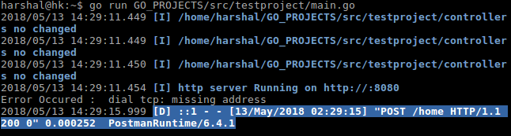

# testproject
testing apis in go lang using beego framwork

I am facing following issue while running this project :

when run project from project folder i.e testproject of go , it works fine: 

`go run main.go `

But when run same from other directory like :

`go run Go_projects/src/testproject/main.go`

redis connection issues occurs :

